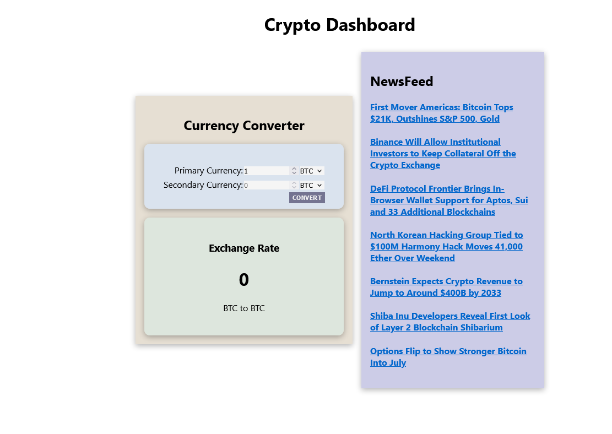
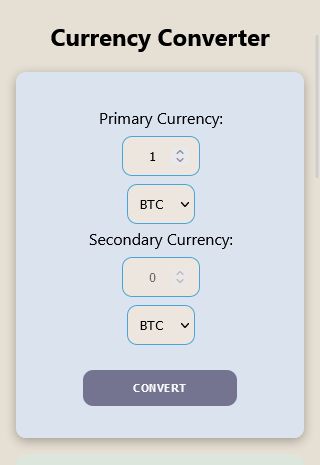

# Crypto Dashboard

This is a personal project to practice the use of APIs and experiment with a backend, although the server is not deployed the file can be found in the "React-App-with-express" branch.

## Table of contents

- [Overview](#overview)
  - [Specifications](#specifications)
  - [Screenshot](#screenshot)
      - [Desktop View](#desktop-view)
      - [Mobile View](#mobile-view)
  - [Links](#links)
- [My process](#my-process)
  - [Built with](#built-with)
  - [What I learned](#what-i-learned)

## Overview

### Specifications

Users should be able to:

- View the optimal layout for each page depending on their device's screen size
- See the current exchange rate for the selected cryptocurrencies
- See a column of current news around the crypto space and go to the site to read more.

### Screenshot

#### Desktop View

#### Mobile View

### Links

- Solution URL: [See source code](https://github.com/davidbriseo/crypto-dashboard/tree/main)
- Live Site URL: [davidbriseo.github.io/crypto-dashboard](https://davidbriseo.github.io/crypto-dashboard/)

- Solution (with Express App) Site URL: [Source code + Express app](https://github.com/davidbriseo/crypto-dashboard/tree/React-App-with-express)

## My process

### Built with

- Semantic HTML5 markup
- CSS custom properties
- Flexbox
- CSS Grid
- Mobile-first workflow
- [React](https://reactjs.org/) - JS library

### What I learned

This project was developed to use test working with a express server, however the final product was not deployed with the backend since that goes beyond the scope for this project. 
